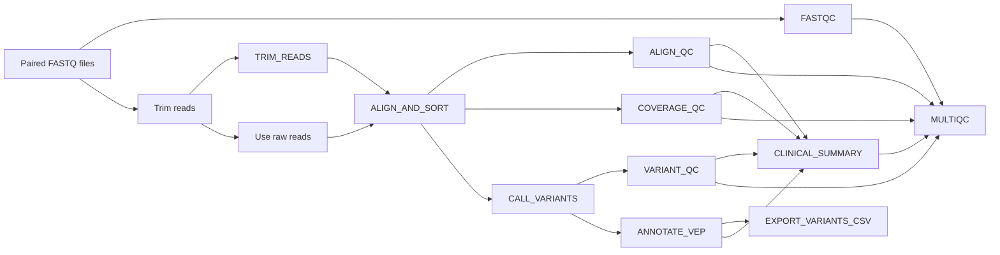

# Genomics Nextflow Variant Calling Pipeline

Repository: `genomics-nextflow-variant-calling`  
Workflow engine: **Nextflow DSL2**  
Environment: **Conda** (`genomics_env`)
---

## 1. Overview

This repository contains a **Nextflow DSL2 pipeline** that performs:

- Read quality control
- (Optional) read trimming
- Short-read alignment to a reference genome
- Alignment and coverage-based QC
- Variant calling (bcftools)
- Variant-level QC
- Functional annotation (VEP, offline cache, GRCh38)
- Export of annotated variants to a flat CSV table for downstream review
- Generation of:
  - A **clinical-style QC & variant summary** in Markdown **and HTML**
  - A **MultiQC** dashboard aggregating all QC metrics


The design and structure mimic real-world pipelines used in clinical and translational genomics (e.g. tumor / exome workflows), but packaged as a **teaching and portfolio project**.

---

## 2. Key Features

- **Variant calling pipeline**
  - `bwa-mem2` alignment
  - `samtools` for BAM processing and QC
  - `bcftools mpileup + call` for variant calling (germline-style)
- **Comprehensive QC stack**
  - Raw read QC: **FastQC**
  - Alignment QC: `samtools flagstat`, `samtools stats`, `samtools idxstats`
  - Coverage QC: `samtools coverage`, `samtools depth`
  - Variant QC: `bcftools stats` (on *raw* VCF)
- **Clinical-style reporting**
  - Single-sample **Markdown + HTML** report
  - Summary overview (“Section 0”) with:
    - Overall QC status: **PASS / WARN / FAIL**
    - Total reads, mapping %, properly paired %
    - Mean coverage and breadth
    - Total variants & Ts/Tv ratio
    - High-impact variant count
  - Detailed sections for alignment, coverage, variant QC, VEP impact, and tool versions
  - Flat CSV export of annotated variants for further filtering / visualisation
- **MultiQC integration**
  - Aggregated QC across:
    - FastQC
    - samtools alignment metrics
    - bcftools stats
    - coverage QC
- **Version logging**
  - Records versions of Nextflow, samtools, bcftools, and VEP in the report
- **Reproducible environment**
  - Conda environment (e.g. `envs/genomics_env.yml`) with all required tools
- **Offline-friendly**
  - Uses VEP in **offline cache** mode (GRCh38)

---

## 3. Pipeline Workflow

### 3.1 High-level flow

1. **Input FASTQs** are discovered (paired-end) under `data/fastq/*_{R1,R2}.fastq.gz`
2. **FASTQC** runs on raw reads
3. **(Optional) TRIM_READS** using `fastp` (quality-based trimming)
4. **ALIGN_AND_SORT** reads to the reference with `bwa-mem2`, then sort + index BAM
5. **ALIGN_QC** runs `samtools flagstat`, `stats`, and `idxstats`
6. **COVERAGE_QC** runs `samtools coverage` and `depth`
7. **CALL_VARIANTS** uses `bcftools mpileup + call` to produce a raw VCF
8. **VARIANT_QC** runs `bcftools stats` on the **raw VCF**
9. **ANNOTATE_VEP** annotates the VCF using Ensembl VEP (offline cache, GRCh38)
10. **CLINICAL_SUMMARY** combines:
    - alignment QC
    - coverage QC
    - variant QC
    - VEP annotation
    into a **clinical-style report** (`*.md` + `*.html`)
11. **MULTIQC** scans the final `results/` folder and produces an HTML QC dashboard

### 3.2 Pipeline workflow



4. Quick Start Guide

4.1 Folder Structure
```
genomics-nextflow-variant-calling/
├── main.nf
├── bin/
│   ├── make_clinical_summary.py
│   └── vep_to_csv.py
├── envs/
│   └── genomics_env.yml
├── data/
│   ├── fastq/
│   │    ├── SAMPLE_R1.fastq.gz
│   │    └── SAMPLE_R2.fastq.gz
│   └── reference/
│        ├── genome.fa
│        ├── genome.fa.fai
│        ├── genome.fa.dict
│        └── bwa-mem2* index files
├── results/
├── work/
```

FASTQs must be named:

sample_R1.fastq.gz

sample_R2.fastq.gz

4.2 Reference Genome Setup

Place the reference at:

data/reference/genome.fa


Build indexes:
```bash
bwa-mem2 index data/reference/genome.fa
samtools faidx data/reference/genome.fa
samtools dict data/reference/genome.fa -o data/reference/genome.fa.dict
```

4.3 Install Conda Environment
```bash
conda env create -f envs/genomics_env.yml
conda activate genomics_env
```

5. Running the Pipeline
5.1 Basic run
```bash
nextflow run main.nf
```
5.2 Enable trimming

Trim at Phred 20:
```bash
nextflow run main.nf --trim_reads true --trim_qual 20
```

Trim at Phred 30:
```bash
nextflow run main.nf --trim_reads true --trim_qual 30
```

5.3 Specify FASTQ pattern
```bash
nextflow run main.nf --reads "data/fastq/SAMPLE_{R1,R2}.fastq.gz"
```

5.4 Specify reference genome
```bash
nextflow run main.nf --reference "data/reference/genome.fa"
```

5.5 Resume a run
```bash
nextflow run main.nf -resume
```

6. Outputs
FASTQC
results/fastqc/

Trimmed FASTQs
results/trimmed/

Aligned BAM
results/bam/sample.sorted.bam

Alignment QC
results/alignment_qc/

Coverage QC
results/coverage_qc/

Raw + Annotated VCF
results/vcf/

Variant QC
results/variant_qc/sample.vcfstats.txt

Annotated Variant CSV
results/variants_csv/sample.variants.csv

Clinical Summary
results/reports/sample_clinical_summary.md
results/reports/sample_clinical_summary.html

MultiQC Output
results/multiqc/multiqc_report.html

7. Cleaning and Re-running
Clean pipeline metadata
```bash
nextflow clean -f
```
Remove work + results
```bash
rm -rf work/ results/
```

Re-run from scratch
```bash
nextflow run main.nf
```

8. Disclaimer

This pipeline is intended as a portfolio project.
It has not undergone analytical validation, regulatory certification, or clinical quality assurance procedures required for diagnostic use.

---
If you would like example data to use then follow the instructions below.
The script below downloads a small paired-end FASTQ sample from the ENA public archive and a minimal GRCh38 (chr22) reference genome from the Ensembl FTP repository, allowing users to run the full pipeline without large datasets.
```bash
bash scripts/download_test_data.sh
```
This will create:
```bash
data/fastq/
    EXAMPLE_T_R1.fastq.gz
    EXAMPLE_T_R2.fastq.gz

data/reference/
    genome.fa
    genome.fa.fai
    genome.fa.dict
    genome.fa.* (bwa-mem2 indexes)
```

Run the pipeline with the downloaded data:
```bash
nextflow run main.nf -profile conda \
  --reads "data/fastq/*_{R1,R2}.fastq.gz" \
  --reference "data/reference/genome.fa"
```

